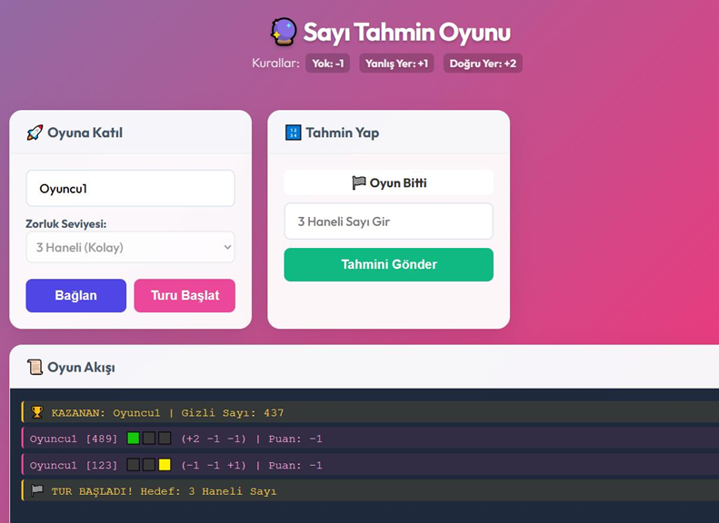

# Sayı Tahmin Oyunu (Multiplayer)

Python (WebSockets) ve Vanilla JavaScript ile geliştirilmiş, sıra tabanlı ve gerçek zamanlı bir çok oyunculu sayı tahmin oyunudur.

## Özellikler
- **Gerçek Zamanlı İletişim:** WebSockets üzerinden anlık veri akışı.
- **Otomatik Odalar:** Seçilen zorluk seviyesine (3-7 hane) göre otomatik odaya atama.
- **Sıra Tabanlı Sistem:** Sadece sırası gelen oyuncu tahmin yapabilir, arayüz buna göre kilitlenir veya açılır.
- **Bağlantı Koruması:** Herhangi bir oyuncu oyundan koptuğunda sunucu çökmez, sıra otomatik olarak bir sonraki kişiye geçer ve liste güncellenir.

## Kurulum ve Çalıştırma
1. Sisteminizde Python yüklü olduğundan emin olun ve terminalden gerekli kütüphaneyi kurun:
   `pip install websockets`
2. Sunucuyu ayağa kaldırmak için projenin bulunduğu dizinde şu komutu çalıştırın:
   `python server.py`
3. Oyuna giriş yapmak için `client/index.html` dosyasını herhangi bir web tarayıcısında açın. Farklı sekmelerde açarak çoklu oyuncu modunu kendiniz test edebilirsiniz.

## Nasıl Oynanır?
Kullanıcı adınızı girip bir zorluk seviyesi seçerek odaya bağlanın. Herhangi bir oyuncu "Turu Başlat" butonuna bastığında oyun başlar. Sıra size geldiğinde tahmininizi gönderin. Puanlama sistemi şu şekildedir:
- 🟩 **Doğru Yer (+2 Puan):** Rakam var ve konumu doğru.
- 🟨 **Yanlış Yer (+1 Puan):** Rakam var ama konumu yanlış.
- ⬛ **Yok (-1 Puan):** Rakam gizli sayıda hiç bulunmuyor.

Gizli sayıyı tam olarak doğru tahmin eden ilk kişi oyunu kazanır.
